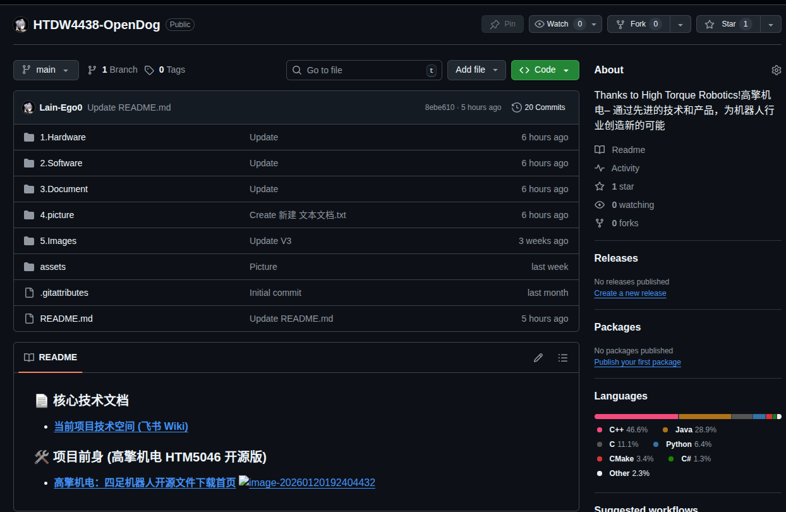

# HTDW4438_HIMloco

[](https://github.com/Lain-Ego0/HTDW4438-OpenDog)

基于 [HIMLoco](https://github.com/InternRobotics/HIMLoco) 的四足机器人强化学习训练与部署框架，面向 [HTDW4438-OpenDog](https://github.com/Lain-Ego0/HTDW4438-OpenDog) 硬件平台。



## 环境要求

- Ubuntu 20.04 LTS
- NVIDIA GPU + CUDA 12.1
- Python 3.8

## 安装

### 1. 安装 CUDA 12.1

```bash
wget https://developer.download.nvidia.com/compute/cuda/12.1.0/local_installers/cuda_12.1.0_530.30.02_linux.run
sudo sh cuda_12.1.0_530.30.02_linux.run
```

### 2. 创建 Conda 环境

```bash
# 安装 Miniconda（如未安装）
wget https://repo.anaconda.com/miniconda/Miniconda3-latest-Linux-x86_64.sh
chmod +x Miniconda3-latest-Linux-x86_64.sh
./Miniconda3-latest-Linux-x86_64.sh

# 从配置文件创建环境
conda env create -f HTDW4438.yml
conda activate Lain_env
```

### 3. 安装 Isaac Gym

从 [NVIDIA Isaac Gym](https://developer.nvidia.com/isaac-gym) 下载 Preview 版本，安装到 `~/isaacgym`：

```bash
cd ~/isaacgym/python && pip install -e .
```

### 4. 验证安装

```bash
python -c "import torch; print('PyTorch GPU:', torch.cuda.is_available())"
```

## 使用

### 训练

```bash
# 训练 HTDW4438 V2
python legged_gym/scripts/train.py --task=htdw_4438 --headless

# 训练 OpenDog
python legged_gym/scripts/train.py --task=opendoge --headless

# 从 checkpoint 恢复训练
python legged_gym/scripts/train.py --task=htdw_4438 --resume --load_run <run_name> --checkpoint <iter>
```

**常用参数：**

| 参数 | 说明 | 默认值 |
|------|------|--------|
| `--task` | 任务名称 | - |
| `--headless` | 无渲染模式（加速训练） | false |
| `--num_envs` | 并行环境数 | 4096 |
| `--resume` | 从 checkpoint 恢复 | false |
| `--load_run` | 指定加载的运行名称 | 最近一次 |
| `--checkpoint` | 指定 checkpoint 编号 | 最新 |
| `--max_iterations` | 最大训练迭代次数 | - |
| `--sim_device` | 仿真设备 | cuda:0 |
| `--rl_device` | RL 计算设备 | cuda:0 |

训练日志保存在 `logs/<experiment_name>/<date_time>_<run_name>/model_<iteration>.pt`。

### 回放

```bash
# 回放最新模型
python legged_gym/scripts/play.py --task=htdw_4438

# 回放指定模型
python legged_gym/scripts/play.py --task=htdw_4438 --load_run <run_name> --checkpoint 2000

# 键盘控制
python legged_gym/scripts/play_keyboard.py --task=htdw_4438
```

Play 会导出 Actor 网络到 `logs/{experiment_name}/exported/policies`（MLP: `policy_1.pt`, LSTM: `policy_lstm_1.pt`）。

### TensorBoard

```bash
tensorboard --logdir=logs/
```

### Sim2Sim (Mujoco 部署)

```bash
python deploy/deploy_mujoco/deploy_keyboard.py --config_name dog_v2
```

**键盘操作：**

| 前进 | 后退 | 左移 | 右移 | 左转 | 右转 |
|------|------|------|------|------|------|
| Up | Down | Left | Right | Ctrl+Left | Ctrl+Right |

## 项目结构

```
HTDW4438_HIMloco/
├── legged_gym/           # 训练环境与脚本
│   ├── envs/             # 各机器人环境定义
│   └── scripts/          # train.py / play.py
├── rsl_rl/               # RSL RL (PPO) 算法库
├── deploy/               # Sim2Sim / Sim2Real 部署
│   └── deploy_mujoco/    # Mujoco 部署脚本与配置
├── resources/robots/     # 机器人 URDF/XML 模型
├── HTDW4438.yml          # Conda 环境配置
└── setup.py              # 包安装
```

## 致谢

- [HIMLoco](https://github.com/InternRobotics/HIMLoco) - 本项目的基础框架
- [quadruped_rl](https://github.com/Benxiaogu/quadruped_rl)
- [himloco_lab](https://github.com/IsaacZH/himloco_lab)

## License

BSD-3-Clause
